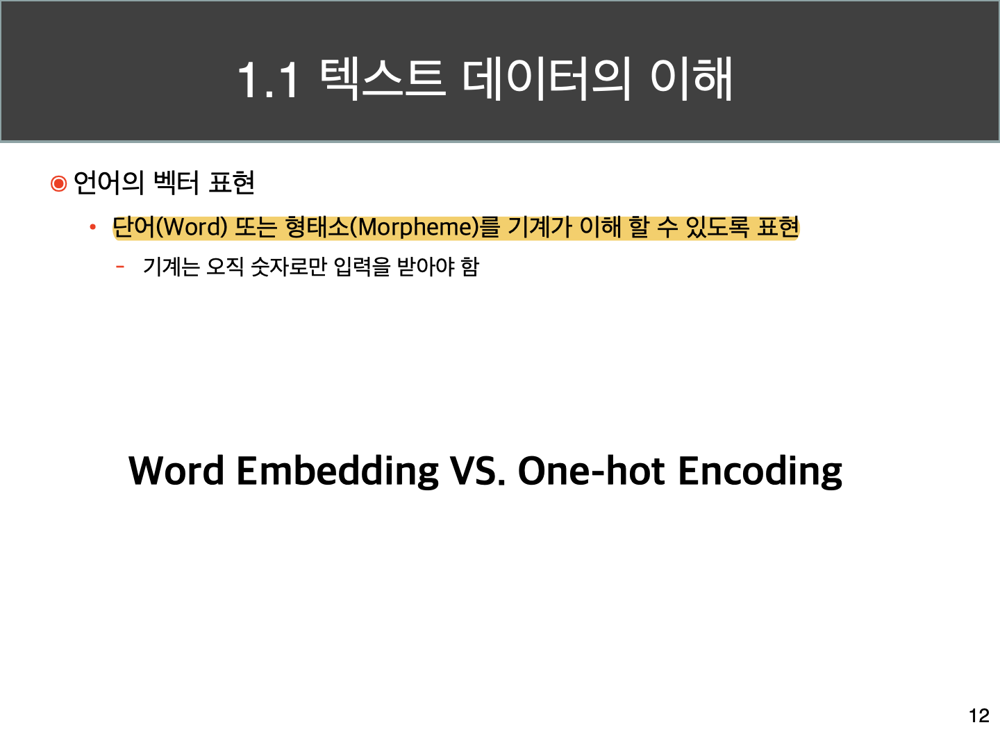
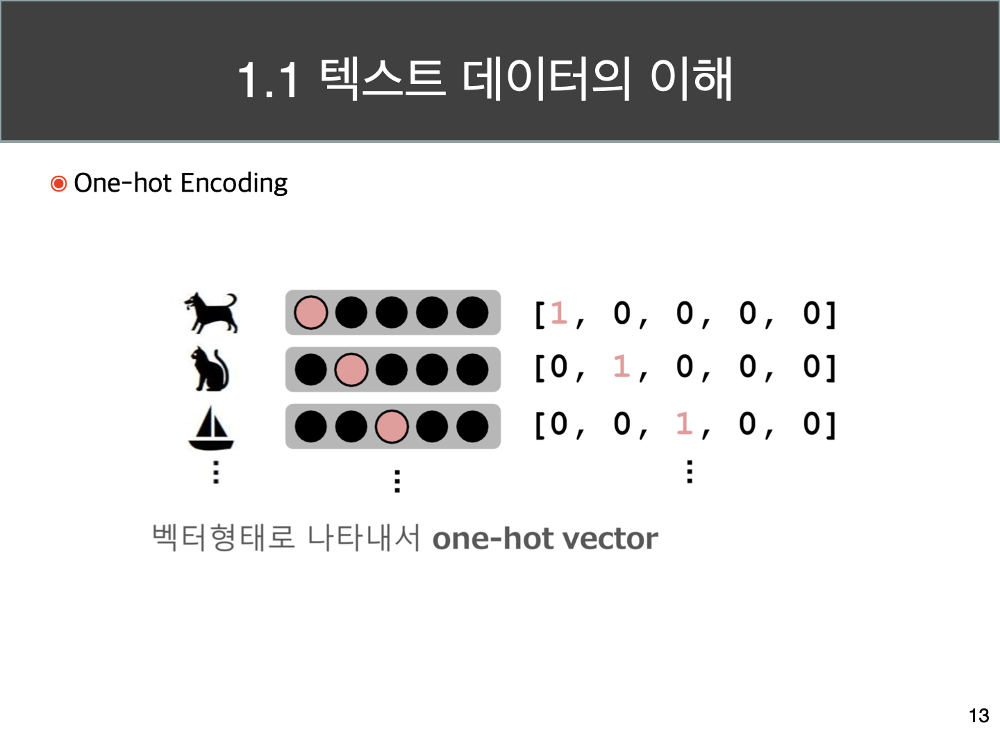
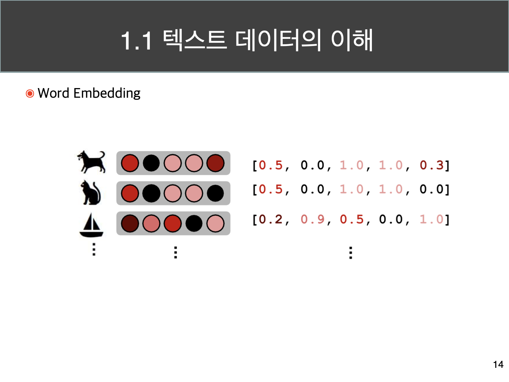
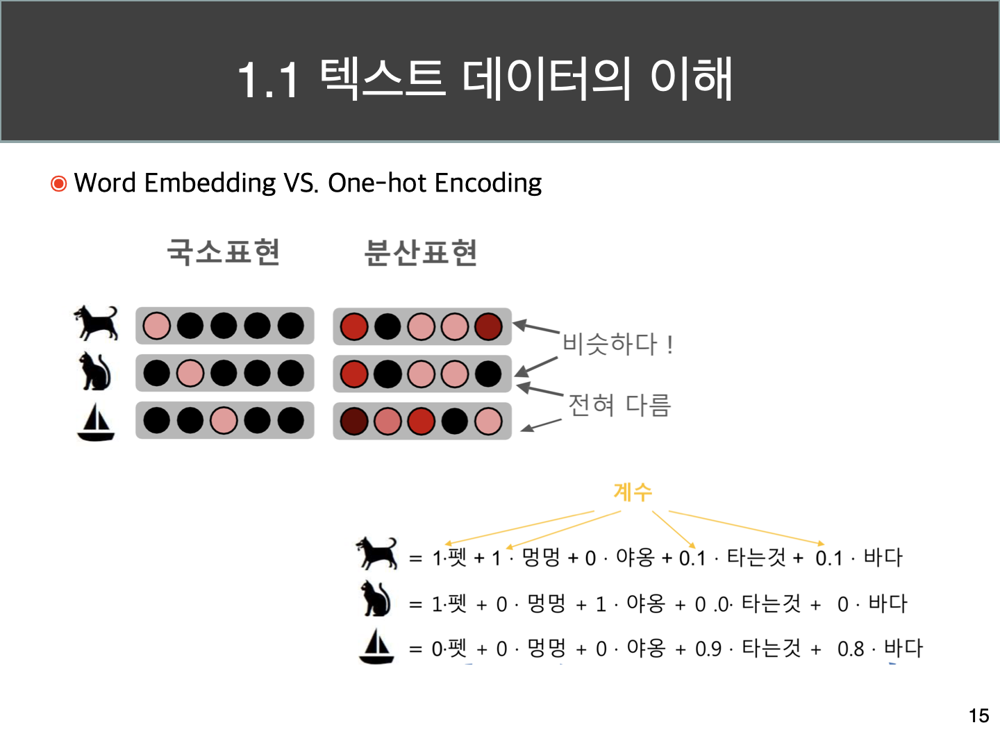
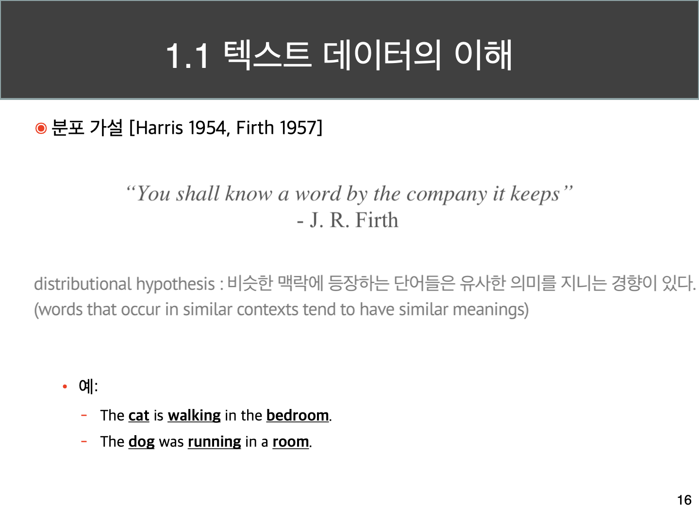
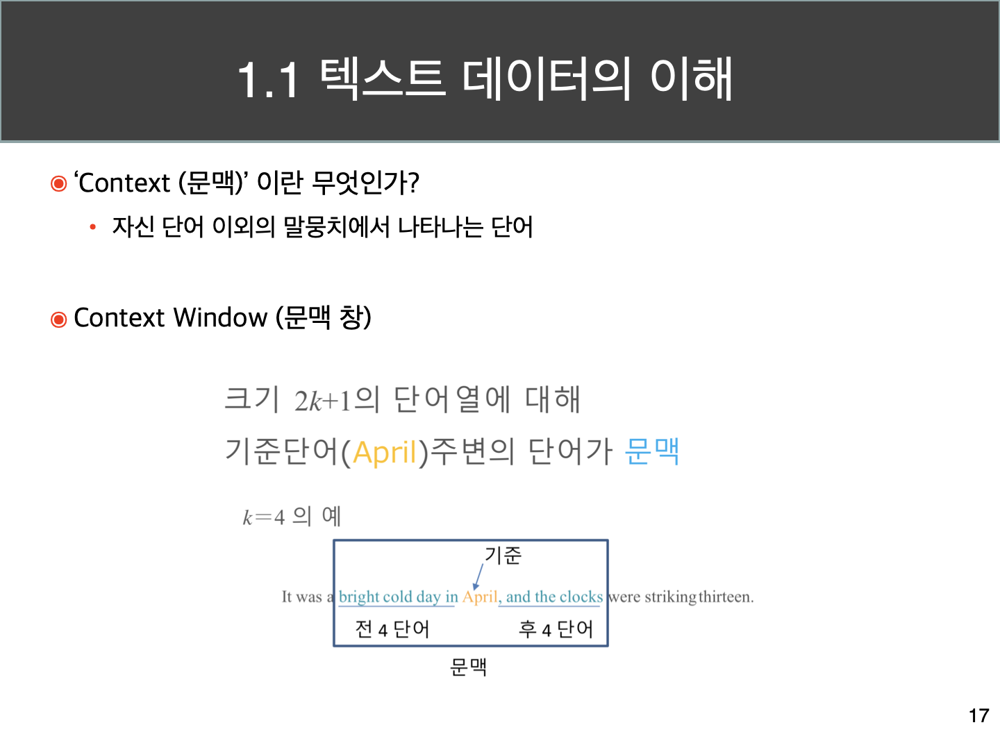
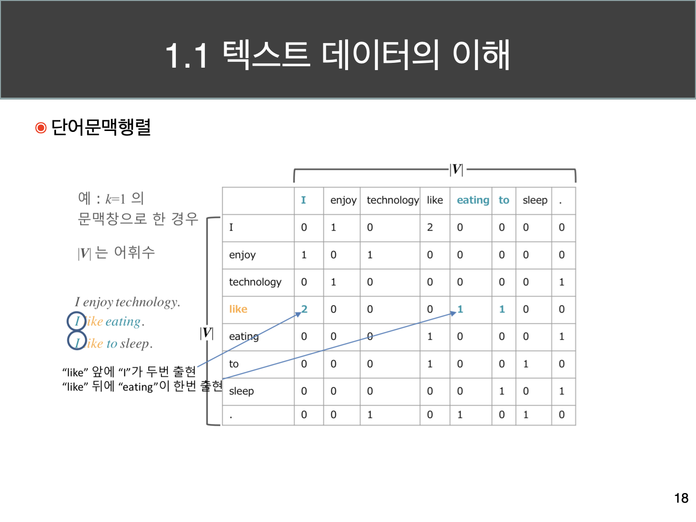
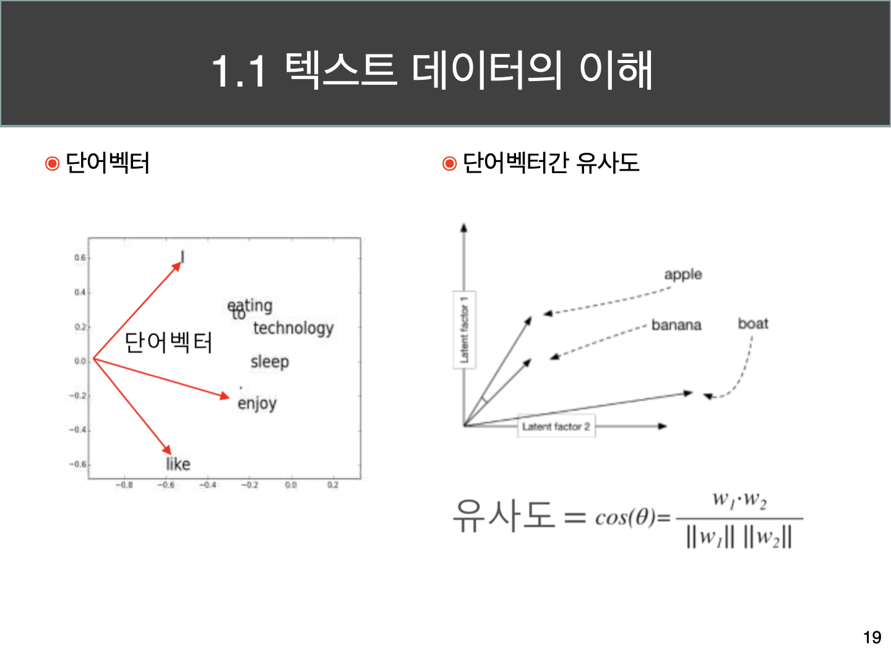
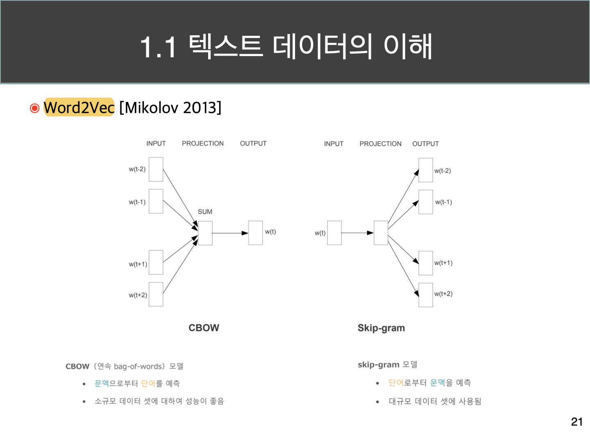

# 자연어 처리 필기

## 1. 자연어 처리 이해

- 언어학, 컴퓨터 공학 (인공지능 기술 포함)이 결합된 분야.
- 

- 컴퓨터가 하는 것
    1. 효율적인 저장
    2. 계산

 

- 기계번역 : 번역은 어려운 문제인데, 정답이 명확하지 않다.

- 단어의 의미가 하나가 아닌 경우가 많다. (동음이의)
- 문구기반 번역에서 단어의 모호성으로 인해 오류가 발생할 수 있다. 

- 글이라는 것은 단어 간 연결 의미를 가진다. 

- 감정분석 : 긍정 또는 부정

추천 ->  openai에서도 

- 로봇 기자

- 어휘 사전 존재 -> 다음에 나올 수 있는 카테고리 -> 모든 카테고리 별로 확률 스코어 분류 -> 높거나 랜덤으로 후보군을 뽑아 예측.

- 형태소 분석을 하려면 형태소마다 다 방식을 적용해야 했음. -> 현재는 sub-word, Token이라는 방식으로 적용하기 시작했음.

- 이는 띄어쓰기를 기준으로 하는 영어식 word와는 다르다.
- 인식할 수 있는 최소 단위 -> token-set

- Large Language Model -> 알고있는 Token Seq 이후 나올 수 있는 모든 token의 확률을 만들어 낼 수 있어야 한다. 따라서 생성도 할 수 있다. 

- 딥러닝의 깊이 있는 아키텍쳐가 큰 영향을 차지 했다고 보심.

- 언어의 벡터 표현 (Word Embedding) -> Rank 개념.

- 벡터는 숫자를 여러개 해놓은 것.
- 스칼라 : 숫자 대입
- One-hot : 벡터
- Word Embedding : 벡터

### One-Hot Encoding

- 자기 자신은 1, 나머지는 0으로 표현하는 형식
- 다른 dimension과 직교하므로 영향이 없다는 특성이 있다.

### Word Embedding

- 부동소수점으로 표현함.
- Transformer 모델은 주변 단어에 따라 벡터 값이 달라지도록 개발되었다. 

- Embedding 값은 어떻게 구할 수 있는가?
    - Word Embedding Vertor를 딥러닝을 통해 출력하도록 처리.

**결국 위 두개의 차이점은 유사도를 반영하느냐에 따라 달라진다고 할 수 있다.**

비슷한 의미를 가진 (주변 단어) 상관관계 중 유사성을 가진 벡터를 만드는 방식이다. -> Cosine, Pearson, Spearman Correlation

빈도 수 기반 벡터 -> 요즘은 스스로 임베딩 벡터를 만들어내고자 하고 있다.

### 분포 가설

- 문맥 : 자신 단어 이외의 말뭉치에서 나타나는 단어이다.

- 문맥 창

- 빈도수 => TF-IDF 방식 
- 코퍼스에 한번도 나오지 않았지만 추후 새로운 시퀀스가 나올 수도 있다. -> 단어문맥행렬 방식의 한계 (빈도수 한계)

- 단어 벡터 간 유사도를 구할 수 있다.
    - 내적을 이용하는 방식 (cosine 유사도) =  cos(theta) = w1 * w2 / (w1 + w2)

- 단어 벡터를 만들어 낼 수 있다면 -> 벡터를 여러 개 

- torch.embedding

- 내 주변의 있는 벡터를 다 더하고 context vector와 내 vector가 가까워질 수 있도록.

